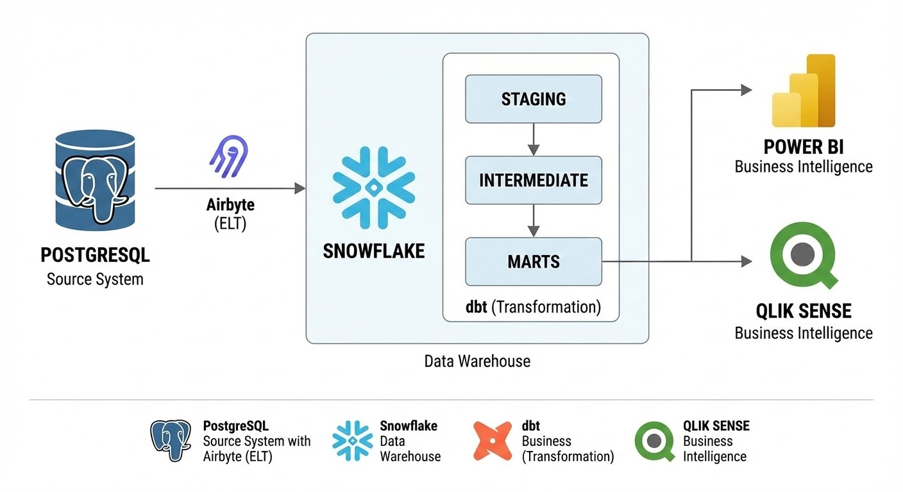
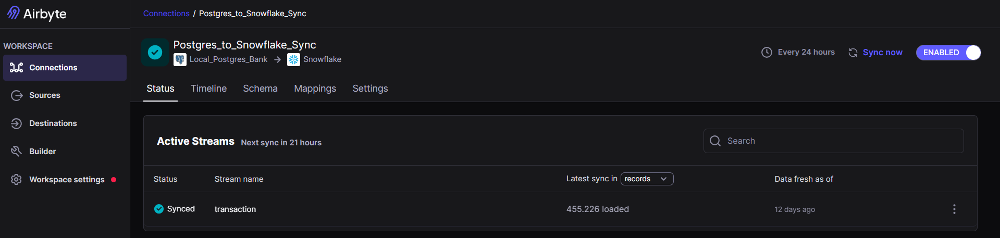
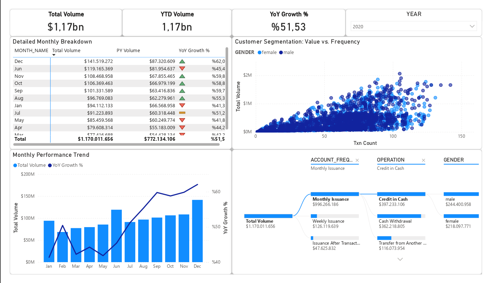
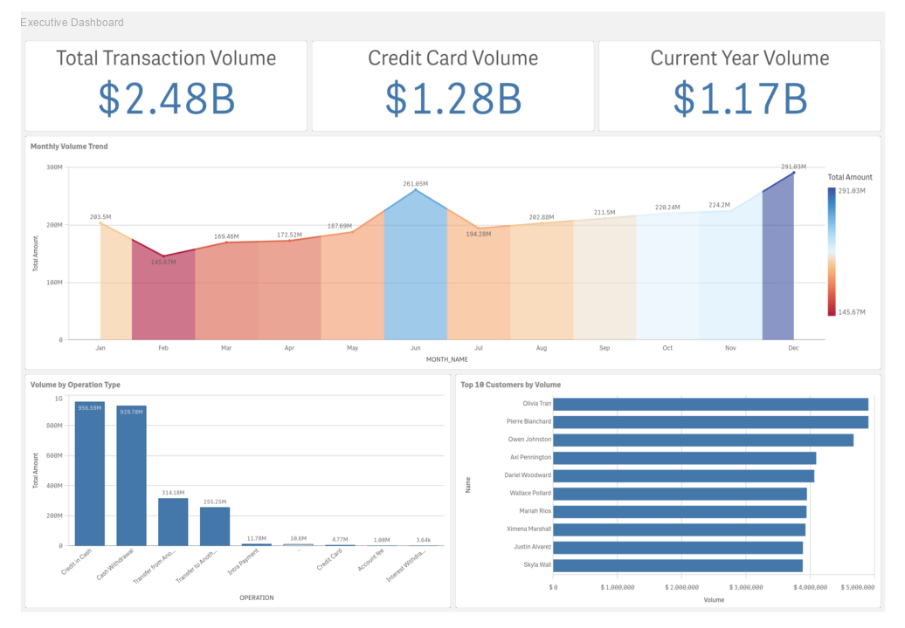
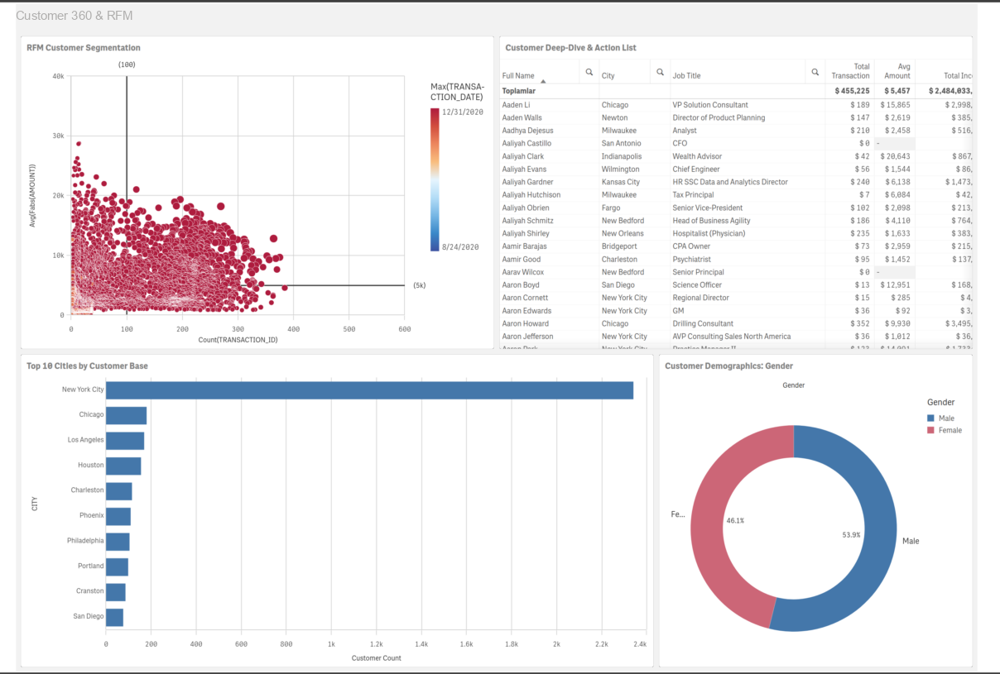
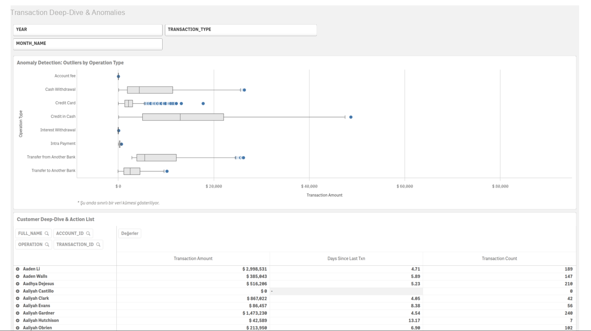

# 🏦 Banking Data Engineering Pipeline

End-to-end data engineering project built on a banking dataset. Raw transactional data is ingested with **Airbyte**, stored and transformed in **Snowflake** using **dbt**, and visualized through **Power BI** and **Qlik Sense** dashboards.

---

## 📐 Architecture



| Layer | Tool |
|-------|------|
| Ingestion | Airbyte |
| Data Warehouse | Snowflake |
| Transformation | dbt (Data Build Tool) |
| Visualization | Power BI, Qlik Sense |

---

## 📁 Project Structure

```
banking-data-engineering/
├── dbt/
│   ├── models/
│   │   ├── sources.yaml          # Raw source definitions
│   │   ├── stg_account.sql       # Staging: Account
│   │   ├── stg_customer.sql      # Staging: Customer
│   │   ├── stg_transaction.sql   # Staging: Transaction
│   │   ├── stg_card.sql          # Staging: Card
│   │   ├── stg_dispositions.sql  # Staging: Disposition
│   │   └── marts/
│   │       ├── dim_account.sql       # Dimension: Account
│   │       ├── dim_customer.sql      # Dimension: Customer
│   │       ├── dim_card.sql          # Dimension: Card
│   │       ├── dim_date.sql          # Dimension: Date
│   │       ├── dim_disposition.sql   # Dimension: Disposition
│   │       └── fct_transactions.sql  # Fact: Transactions (Incremental)
│   ├── macros/
│   │   └── categorize_amount.sql # Macro: Transaction amount categorization
│   └── snapshots/
│       └── snp_customer.sql      # SCD Type 2: Customer snapshot
├── dashboards/
│   ├── Banking_App.pbix          # Power BI dashboard
│   └── Banking_App.qvf           # Qlik Sense dashboard
└── images/
```

---

## 🔄 Data Flow

### 1. Ingestion — Airbyte
Raw banking data is ingested from the source system into Snowflake's `RAW_DATA` schema using Airbyte connectors.




### 2. Transformation — dbt

The dbt project follows a two-layer transformation approach:

**Staging Layer (`stg_*`)**  
Cleans and standardizes column names from raw source tables:
- `stg_account` — Account frequency and creation date
- `stg_customer` — Customer demographics (name, gender, birth date, salary, location)
- `stg_transaction` — Transaction type, amount, balance, and date
- `stg_card` — Card information
- `stg_dispositions` — Account-customer relationship

**Marts Layer (`dim_*` / `fct_*`)**  
Business-ready dimensional models following a star schema:

| Model | Type | Description |
|-------|------|-------------|
| `dim_customer` | Dimension | Customer details |
| `dim_account` | Dimension | Account details |
| `dim_card` | Dimension | Card details |
| `dim_date` | Dimension | Date dimension |
| `dim_disposition` | Dimension | Account-customer mapping |
| `fct_transactions` | Fact | Incremental transaction fact table |

### 3. Key dbt Features Used

**Incremental Model**  
`fct_transactions` is materialized as an incremental model. On each run, only new transactions (based on `transaction_date`) are loaded, improving performance on large datasets.

```sql
{{ config(materialized='incremental', unique_key='transaction_id') }}
```

**Custom Macro**  
`categorize_amount` macro categorizes transaction amounts into business-friendly buckets:

| Category | Range |
|----------|-------|
| Low Value | < 1,000 |
| Medium Value | 1,000 – 10,000 |
| High Value | > 10,000 |

**Snapshot (SCD Type 2)**  
`snp_customer` tracks historical changes in customer `city`, `salary`, and `job_title` using dbt's built-in snapshot strategy.

---

## 📊 Dashboards

### Power BI


### Qlik Sense




---

## 🛠️ Setup & Usage

### Prerequisites
- Snowflake account
- Airbyte (Cloud or self-hosted)
- dbt Core or dbt Cloud
- Power BI Desktop / Qlik Sense

### Running dbt Models

```bash
# Install dependencies
pip install dbt-snowflake

# Configure your Snowflake profile in ~/.dbt/profiles.yml

# Run all models
dbt run

# Run staging models only
dbt run --select stg_*

# Run mart models only
dbt run --select marts.*

# Run snapshots
dbt snapshot

# Run tests
dbt test
```

---

## 🗄️ Snowflake Configuration

| Parameter | Value |
|-----------|-------|
| Database | `AMERICANRETAILBANK` |
| Raw Schema | `RAW_DATA` |
| Target Schema | `dbt_aalkan` |

---

## 🧰 Tech Stack


